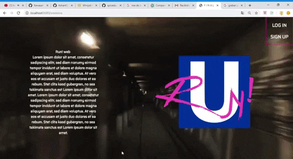

# RUN! (Web version)

*Run!* is an app to inform users about fare inspections in the Berlin-Brandenburg transportation network area.

(This app is under construction and there are more features, improvements, and a mobile version coming)

## Project description
*Run!* aims at fighting an abusive transportation fare system in a city that is changing fast, where the average price of all aspects of life is rising, but not citizens' incomes. *Run!* allows users help each other by reporting fare inspections.

When users log in, they will find a "Report Wall" on the left side with the controls reported in the last 24 h.

As background there is a map of the city with pointers marking the location of the reported controls. 

On the right side, users will find a side bar with 

## Stack
    React, Google Maps API
    Express
    Sockets
    VBB JavaScript modules by @derhuerst
    

#### App

-   Toggle Push Notifications: https://developers.google.com/web/ilt/pwa/introduction-to-push-notifications

*   List of last recorded controls:

    -   modal: Report a control: Username, Timestamp, Location, Line and Direction(options dropdown), other(maybe a description of the controllers).
    -   modal: Map with pointers //react google maps
    -   (possible) Interactive map: when clicking on station pointer shows statistics.

*   Statistics: Control prevalence in time per line.

    -   Parameters: Days of the month, at what time.

*   Legal Advice: A section to inform users of their rights. How to proceed in case they get caught, sanctions, controller's performace limitation.

*   Profile: Edit profile, password

*   About us

*   Log out
